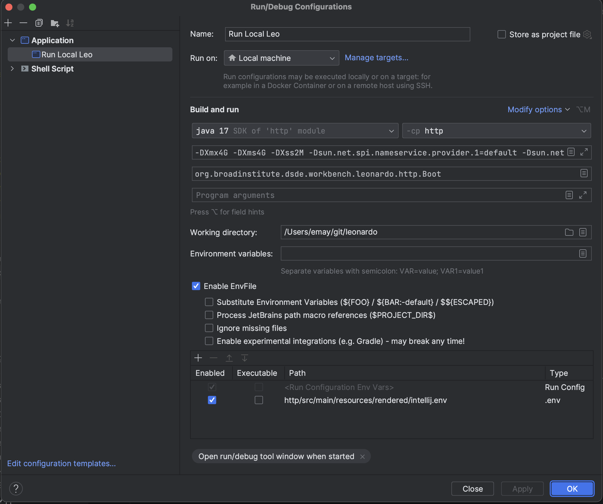
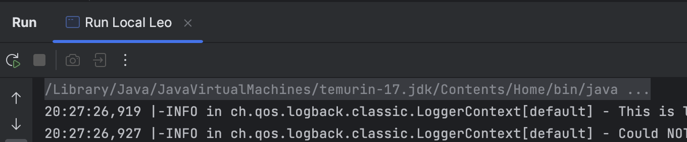
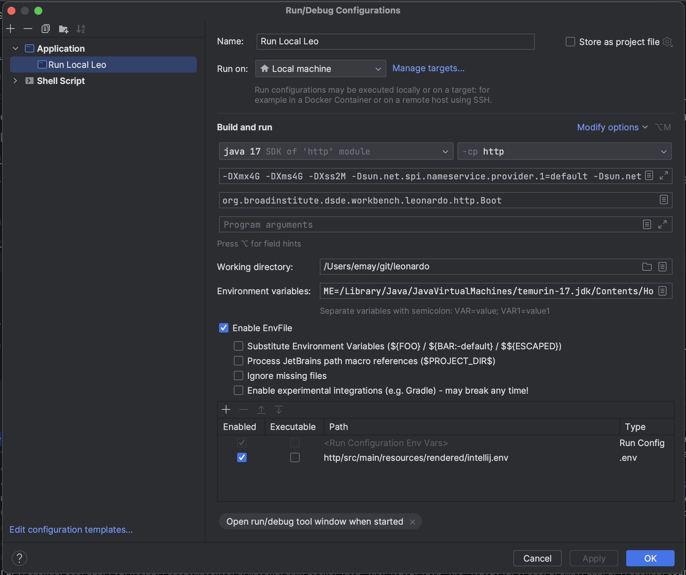
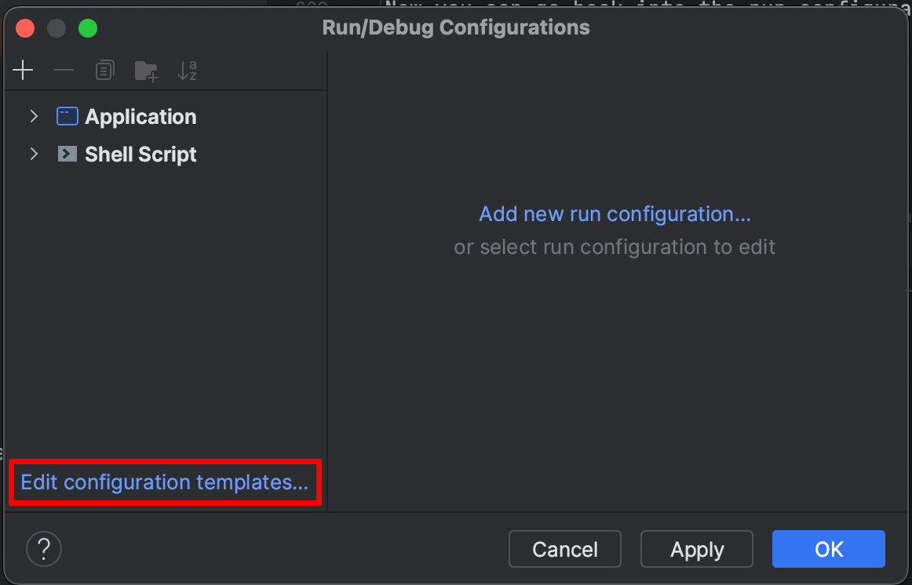
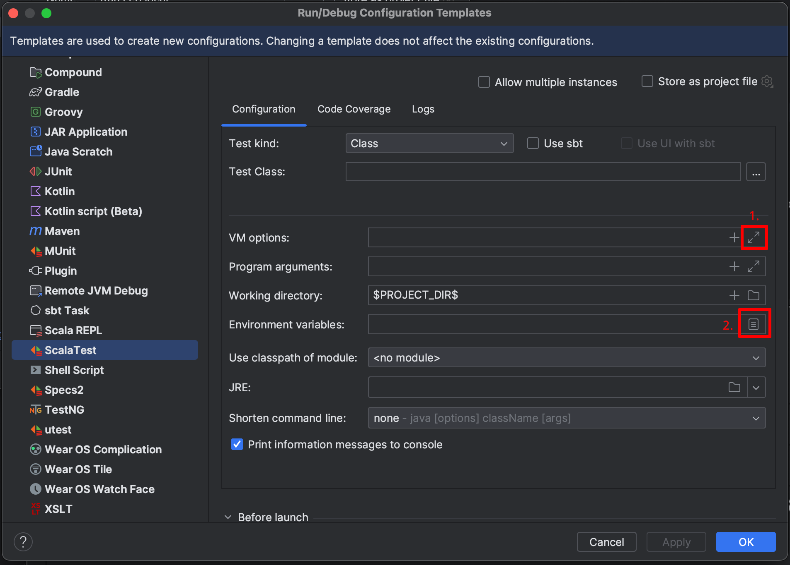
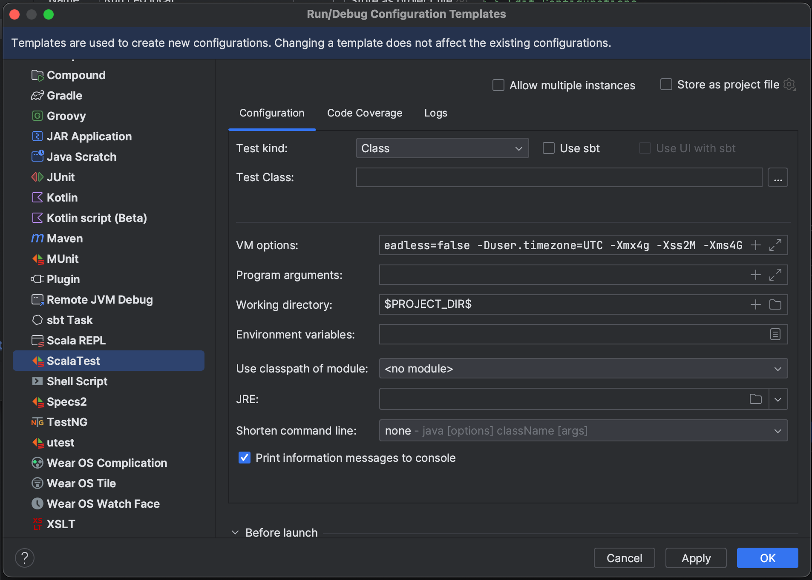
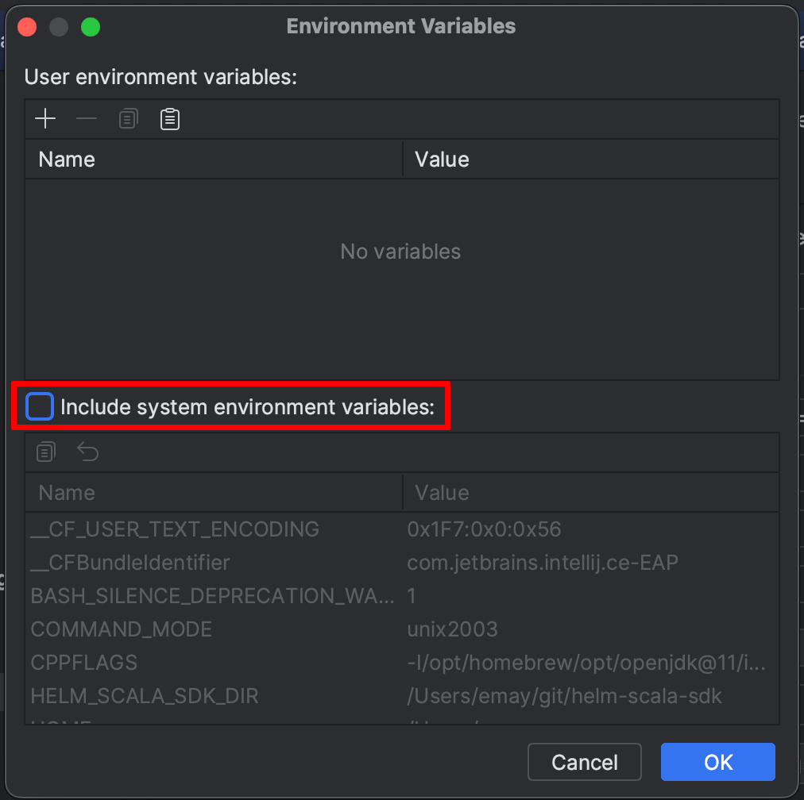
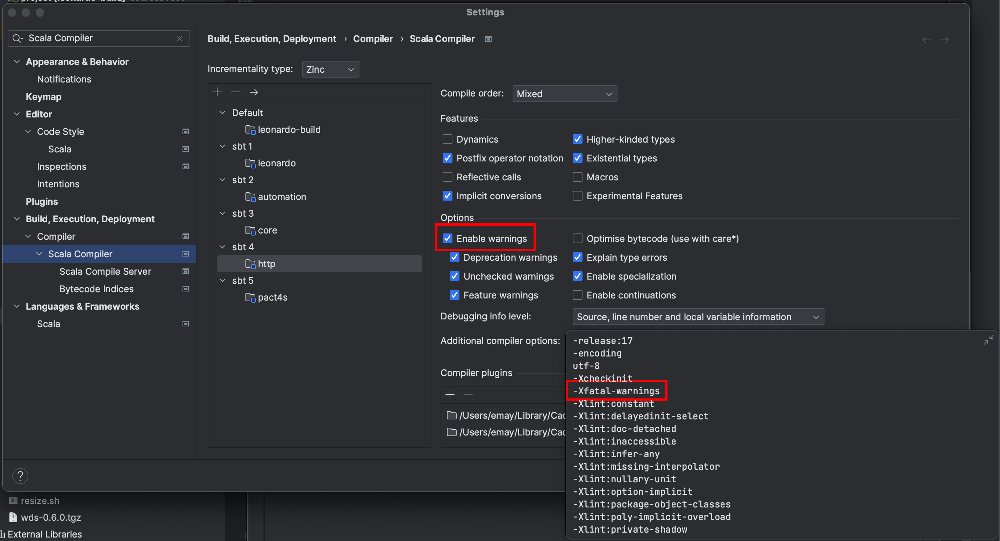
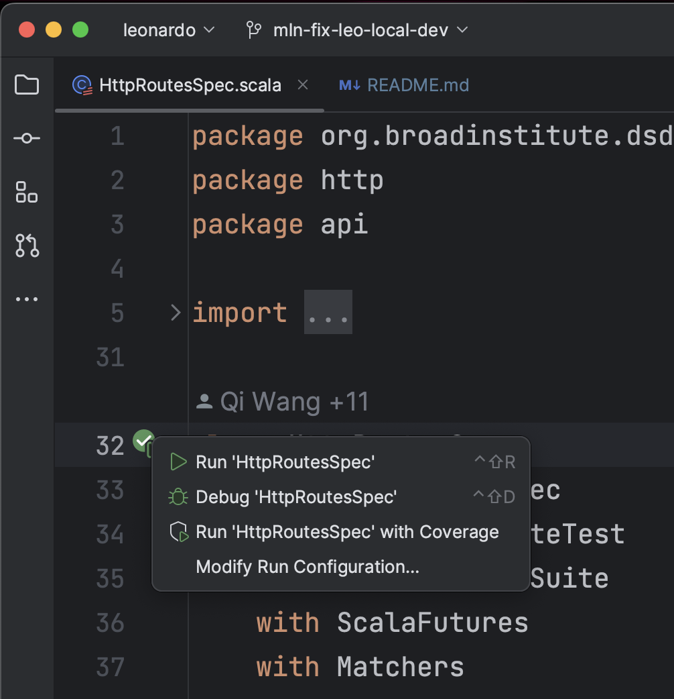
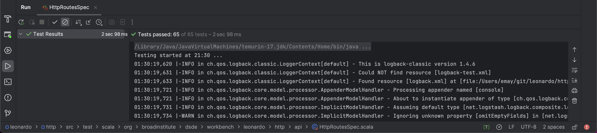

[](https://github.com/DataBiosphere/leonardo/actions) [](https://codecov.io/gh/DataBiosphere/leonardo)

# Leonardo

`leonardo` serves as a way to launch compute within the Terra security boundary. 
It does so via multiple different cloud hardware virtualization mechanisms, currently leveraging only the Google Cloud Platform (GCP) and Azure .

`leonardo` supports launching the following services for compute:
- Spark clusters through [Google Dataproc](https://cloud.google.com/dataproc/)
- Virtual machines through [Google Compute Engine](https://cloud.google.com/compute)
- Kubernetes 'apps' through [Google Kubernetes Engine](https://cloud.google.com/kubernetes-engine)

Currently, `leonardo` supports the launching of custom docker images for Jupyter and Rstudio in virtual machines and 
Dataproc. It also supports launching applications in Kubernetes, with a spotlight on Galaxy.

- For more information on APIs, see [swagger](https://notebooks.firecloud.org/)
- For more information on custom docker images, see the [terra-docker repo](https://github.com/databiosphere/terra-docker)
- For more information on applications we support in Kubernetes, see the [terra-apps repo](https://github.com/databiosphere/terra-app)
- For more information on Galaxy, see the [Galaxy Project](https://github.com/galaxyproject)

It is recommended to consume these APIs and functionality via the [Terra UI](https://terra.bio/)

We use JIRA instead of the issues page on GitHub. If you would like to see what we are working you can visit our
[active sprint](https://broadworkbench.atlassian.net/secure/RapidBoard.jspa?rapidView=35&projectKey=IA) or our
[backlog](https://broadworkbench.atlassian.net/secure/RapidBoard.jspa?rapidView=35&projectKey=IA&view=planning&selectedIssue=IA-1753&epics=visible&issueLimit=100&selectedEpic=IA-1715)
on JIRA. You will need to set up an account to access, but it is open to the public.

## Setting up a Java Client Library

Add the `leonardo-client` to your build. An example for `sbt` is below:

```sbt
libraryDependencies += "org.broadinstitute.dsde.workbench" %% "leonardo-client" % "1.3.6-<git hash>"
```

Please be sure to replace the `<git hash>` with the first 7 characters of the commit hash of the HEAD of `develop`.
You can find a list of available releases and `<git hash>`-es from [artifactory](https://broadinstitute.jfrog.io/ui/native/libs-release-local;build.timestamp=1679578230/org/broadinstitute/dsde/workbench/leonardo-client_2.11/)

Example Scala Usage:

```scala
import org.broadinstitute.dsde.workbench.client.leonardo.api.RuntimesApi
import org.broadinstitute.dsde.workbench.client.leonardo.ApiClient
import org.broadinstitute.dsde.workbench.client.leonardo.model.GetRuntimeResponse

class LeonardoClient(leonardoBasePath: String) {
  private def leonardoApi(accessToken: String): RuntimesApi = {
    val apiClient = new ApiClient()
    apiClient.setAccessToken(accessToken)
    apiClient.setBasePath(leonardoBasePath)
    new RuntimesApi(apiClient)
  }

  def getAzureRuntimeDetails(token: String, workspaceId: String, runtimeName: String): GetRuntimeResponse = {
    val leonardoApi = leonardoApi(token)
    leonardoApi.getAzureRuntime(workspaceId, runtimeName)
  }
}
```

## Building and running `leonardo` locally

To run `leonardo` locally, you are going to need the following:

- The `leonardo` codebase
- The necessary dependencies installed
- A connection to a `leonardo` database

The following sections take you through those steps in a logical order.

### Clone the repo and submodules

The first step is to get the code.
This will allow you to not only follow [this README](README.md) locally, you will also be able to install setup
the environmental dependencies as well as build `leonardo` locally.

```sh
git clone https://github.com/databiosphere/leonardo.git
cd leonardo
```

And as an aside, this repository uses git submodules. You will need to execute the following commands as well:

```sh
git submodule update --init --recursive
```

### Install `leonardo`'s dependencies

The following tools are required to run `leonardo`:

- vault
- docker
- google-cloud-sdk
- cloud-sql-proxy
- [gke-gcloud-auth-plugin](https://cloud.google.com/blog/products/containers-kubernetes/kubectl-auth-changes-in-gke)
- java
- sbt
- go

Please feel free to install each tool individually as you see fit for your environment, or
you can follow along with this process to get your environment set up.
Tool setup is facilitated through the use of [`brew`](https://brew.io). This allows us to have a little consistency
across environments thanks to the `Brewfile.lock.json`

- Install `brew`.
  ```shell
  /bin/bash -c "$(curl -fsSL https://raw.githubusercontent.com/Homebrew/install/HEAD/install.sh)"

  # be sure to update your .[X]profile or .[X]shrc file with the following
  # this assumes a default install location for `brew`
  echo 'eval "$(/opt/homebrew/bin/brew shellenv)"' >> .zprofile
  ```
  After the `brew` install, validate that you have a working `brew` installation be executing `brew help`.
  Feel free to [turn off Anonymous Analytics](https://docs.brew.sh/Analytics) with the following command:
  ```sh
  brew analytics off
  ```

- Following the `brew`-install, you should be able to install the necessary tools to setup the remaining dependencies.

  ```shell
  brew bundle
  ```

  This will install the following resources for you:

  - git
  - vault
  - mysql-client
  - docker
  - azure-cli
  - google-cloud-sdk
  - cloud-sql-proxy
  - sdkman (to support `java` and `sbt` environment management)
  - go

  **NOTE:** If you already have `docker Desktop` installed, you may run into some collisions. You have a couple
  of options:

  - Uninstall docker. The instructions are here.
  - Accept the failure and the fact that `docker Desktop` will not be managed through `brew`
  - Both are fully acceptable - :slightly_smiling_face:

  **NOTE:** Please note that we lean on `sdkman` to manage our java-based SDKs - specifically `java` and `sbt`.
  If you are managing your own java-based environments in another manner, please feel free to comment out `sdkman`
  before executing the command above.

  **NOTE:** Ensure that you are running go>=1.20 by running. This is needed to compile `helm`


- Following the `brew bundle` update, you need to do some environment updating of your dot-files.
  The default MacOS shell uses `zsh` ([short explanation here](https://discussions.apple.com/thread/250722978)).
  If you are using another shell, you will need to update your appropriate dot-files
  for that shell environment.

  ```sh
  echo '
  # make sure the google-cloud-sdk cli is on your path
  export PATH=$(brew --prefix)/share/google-cloud-sdk/bin:$PATH
  export PATH=$(brew --prefix)/opt/mysql-client/bin:$PATH

  # https://broadworkbench.atlassian.net/wiki/spaces/IA/pages/2848063491/Dev+Environment+Setup
  export SBT_OPTS="-Xmx2G -Xms1G -Dmysql.host=localhost -Dmysql.port=3311 -Duser.timezone=GMT"

  # various `leonardo` tool-setup variables
  export VAULT_ADDR="https://clotho.broadinstitute.org:8200"
  # NOTE: from local/depends.sh - double check variable name: HELM_BUILD_DIR
  # or is this even needed
  export HELM_SCALA_SDK_DIR="/Users/pate/workbench/helm-scala-sdk"

  # cloud-sql-proxy environment variables
  # feel free to override the defaults
  export GOOGLE_PROJECT=broad-dsde-dev
  export CLOUDSQL_ZONE=us-central1
  #
  # also used by `leonardo`
  export CLOUDSQL_INSTANCE=[INSERT-YOUR-CLOUD-SQL-CONNECTION-NAME-HERE]

  # `leonardo`-specific environment variables
  export DB_USER=leonardo
  export DB_PASSWORD=password

  #THIS MUST BE AT THE END OF THE FILE FOR SDKMAN TO WORK!!!
  export SDKMAN_DIR=$(brew --prefix sdkman-cli)/libexec
  [[ -s "${SDKMAN_DIR}/bin/sdkman-init.sh" ]] && source "${SDKMAN_DIR}/bin/sdkman-init.sh"' >> ~/.zprofile
  ```

- After adding those values to your environment's dot-file, please ensure they are loaded into your environment
  by either restarting your terminal or `source`-ing them into your current session.

  If you have `java` and `sbt` installed already, you can skip this step.
  Otherwise, run the following commands to install the version of java and sbt we are currently supporting

  (see `.sdkmanrc` in the `leonardo/`-directory for version info).

  ```sh
  sdk env install
  ```

  At this point, `sdkman` will have set up your `JAVA_HOME` and `SBT_HOME` environment variables accordingly.
  You will have to run `sdk env` each time your current working directory is `leonardo/`.
  To always use the correct `JAVA_HOME` and `SBT_HOME` every time you drop into the `leonardo/` directory,
  you can turn on `sdkman_auto_env`. To do so, please execute `sdk config` and change the configured value of
  `sdkman_auto_env` from `false` to `true`.


- We need to install one more thing - `gke-gcloud-auth-plugin`.  
  This will also validate that our `gcloud`-cli is installed and running appropriately.

  ```sh
  gcloud auth login
  gcloud components install gke-gcloud-auth-plugin
  ```

  To make sure the `gke-gcloud-auth-plugin` is installed correctly, [please give the following command a try](https://cloud.google.com/blog/products/containers-kubernetes/kubectl-auth-changes-in-gke).

  ```sh
  gke-gcloud-auth-plugin --version 
  ```

At this point all the third party dependencies have been installed, and the environment variables necessary to support 
those tools have been set up. 

Next up, interacting with the `leonardo`-repository! - :nerd_face: 

### Identify and Set up your MySQL database

#### Establish a local proxy to the Cloud SQL remote instance

1. Run the following command to setup your `gcloud`-cli to work with ``

   ```sh
   gcloud auth application-default login
   ```

   **NOTE:** You may need to run `gcloud config set project <PROJECT_ID>` if your environment is setup to use 
   a different Google Cloud Project


2. Navigate your browser to the [Cloud SQL dashboard](https://console.cloud.google.com/sql/instances),
   - Select your database's _Instance Overview_ screen by clicking on it's `Instance ID`, and then
   - In the `Connect to this instance`-section, copy the `Connection name`


3. In the [Cloud SQL dashboard](https://console.cloud.google.com/sql/instances) for your instance, 
   Reset the passwords for the users () 
   - Select your database's _Instance Overview_ screen by clicking on it's `Instance ID`, 
   - Select the `Users` option from the menu on the left,
   - Select the three vertical dots for the user, and then
   - `Change password`

   **NOTE**: You will want to update your environment (.zprofile - see above or locally) 
   with the correct `username` and `password`

   ```shell
   export CLOUDSQL_INSTANCE=<your cloned db name> # for Leo and CloudSQL proxy
   export DB_USER=<db username> # for Leo only, not CloudSQL proxy
   export DB_PASSWORD=<db password> # for Leo only, not CloudSQL proxy
   ```

3. Execute the following command in a terminal window to establish a local connection to the database.
   Mind that you will need to be connected to the VPN.

   ```sh
   cloud-sql-proxy [CLOUD-SQL-CONNECTION-NAME-HERE]
   ```

#### Other database info ...

You can add more vars for the CloudSQL proxy container by editing `./local/sqlproxy.env`.

### Building and running `leonardo` locally

#### VPN

You must be connected to the VPN to complete the rest of this process.

#### Building local dependencies

Leo needs a copy of the Go Helm library and secrets, files, and env vars stored in k8s.

- To build the Go Helm library and get k8s resources, run:

  ```sh
  ./local/depends.sh -y
  ```

- To only build the Go Helm library, run:

  ```sh
  ./local/depends.sh helm
  ```

- To only get k8s resources, run:

  ```sh
  ./local/depends.sh configs
  ```

#### Overrides

By adding entries to `./local/overrides.env`, you can override the value of any variable from k8s for Leo.

#### Unsetting

By adding entries to `./local/unset.env`, you can remove variables from k8s for Leo. Applied after retrieving
variables from k8s and before applying overrides.

#### Host alias

If you haven't already, add `127.0.0.1       local.dsde-dev.broadinstitute.org` to `/etc/hosts`:

```shell
sudo sh -c "echo '127.0.0.1       local.dsde-dev.broadinstitute.org' >> /etc/hosts"
```

#### Run proxies

- To run the CloudSQL and Apache proxies, run:

  ```shell
  ./local/proxies.sh start
  ```

- You can also stop them:

  ```shell
  ./local/proxies.sh stop
  ```

- Or restart them:

  ```shell
  ./local/proxies.sh restart
  ```

- If the CloudSQL proxy fails to start with an error like:

  ```shell
  Bind for 0.0.0.0:3306 failed: port is already allocated
  ```

  Run this to find the PID of the process using that port:

  ```shell
  sudo lsof -i tcp:3306
  ```

  And then kill that process:

  ```shell
  sudo kill -TERM <pid>
  ```

#### Run `leonardo`

- Export required env vars as created by `./local/depends.sh`

  ```shell
  . ./http/src/main/resources/rendered/sbt.env.sh
  ```

- Call the sbt `http/run` target:

  ```sh
  sbt http/run
  ```

  ... or start an sbt shell and go from there:

  ```
  sbt
  ```

#### Troubleshooting `leonardo`

- If you receive the following error while starting up `leonardo`

  ```shell
  Caused by: com.typesafe.config.ConfigException$Missing: merge of leo.conf @ jar:file:/Users/.../leonardo/target/bg-jobs/sbt_10c9d98e/job-1/target/ae6bfc74/85357ed8/http_2.13-da789a092.jar!/leo.conf: 13,reference.conf @ jar:file:/Users/.../leonardo/target/bg-jobs/sbt_10c9d98e/job-1/target/ae6bfc74/85357ed8/http_2.13-da789a092.jar!/reference.conf: 606: No configuration setting found for key 'subEmail'
  ```

  Then you need to make sure your environment is setup with the necessary
  `leonardo` environment variables.
  Please be sure that you have run the following command in your current
  terminal session and retry your `leonardo`-startup.

  ```shell
  . ./http/src/main/resources/rendered/sbt.env.sh
  ```

#### Architecture issues
If you get an error like
```
Exception in thread "io-compute-6" java.lang.UnsatisfiedLinkError: Unable to load library 'helm':
...
(mach-o file, but is an incompatible architecture (have 'arm64', need 'x86_64')),
...
```
You are probably on an M1 (arm64) running an amd64 (x86_64) version of Java. You can verify by first finding and setting your `JAVA_HOME` (e.g. with `which java` or jenv if present) and then checking the output of
```
file "${JAVA_HOME}/bin/java
```
It should read something like
```
/Library/Java/JavaVirtualMachines/temurin-17.jdk/Contents/Home/bin/java: Mach-O 64-bit executable arm64
```
Note the **Mach-O 64-bit executable arm64**. Otherwise, install an arm64 version of Java and try again. [Adoptium](https://adoptium.net/) should work fine.

#### Verify that local Leo is running
[Status endpoint:
https://local.dsde-dev.broadinstitute.org/status](https://local.dsde-dev.broadinstitute.org/status)

[Swagger page:
https://local.dsde-dev.broadinstitute.org](https://local.dsde-dev.broadinstitute.org)

#### Debugging in IntelliJ
1. Install the [EnvFile plugin](https://plugins.jetbrains.com/plugin/7861-envfile)
2. Install the [Scala plugin](https://plugins.jetbrains.com/plugin/1347-scala)
3. Set up a new `Application` run configuration in `Run > Edit Configurations`:

(You may need to use the "Modify options" dropdown to unlock options like "Environment variables", "EnvFile", and "Add VM options")

4. Determine your Java home

The above configuration will fail to run properly due to missing `JAVA_HOME` in the environment. Unfortunately, IntelliJ doesn't propagate this to the running app. To figure out what it is, first run the new configuration, and scroll back up to the top of the output. The first line should look like:

Which means that `JAVA_HOME` should be set to `/Library/Java/JavaVirtualMachines/temurin-17.jdk/Contents/Home`.

Now you can go back into the run configuration and add it to the "Environment variables" section:


5. Run it!

#### Run Tests in IntelliJ
In order to use the GUI elements to run tests, some runtime configuration template changes are needed:
1. Set default ScalaTest runtime configuration options in `Run > Edit Configurations`

First, open the template settings:

Then, go to `ScalaTest`:

Open `VM Options` (labeled "1" above) and add the `JAVA_OPTS` from [Run Leonardo unit tests](#run-leonardo-unit-tests), which should end up looking like:

Open `Environment variables` (labeled "2" above) and uncheck `Include system environment variables`:

2. Change Scala compiler options in IntelliJ settings

IntelliJ isn't smart enough to set compiler flags differently between the source and test targets. To hack around this, open `Settings > Build, Execution, Deployment > Compier > Scala Compiler` and select **each** module. Then uncheck `Enable warnings`.

**NOTE: These changes may revert when you reload the sbt project!** Repeat this step to fix tests complaining about warnings that have been turned into errors.
If you get errors after compilation but before the tests run, try deleting your test Runtime Configuration, running `git clean -xfd -e .idea` to clean project files, redoing dependencies/configs, restarting IntelliJ, and redoing the above steps before rerunning tests.

3. Make sure the local MySQL server is running by following the instructions in [Run Leonardo unit tests](#run-leonardo-unit-tests).
4. Find a test to run and click on the green arrow next to the test to run it normally or using the debugger:

5. Run it!

You should see something like



#### Connecting to the MySQL database via the CloudSQL proxy
Once you've rendered the configs, started the CloudSQL proxy, and sourced the env vars required to run Leo, you can connect to your database with:
```
./local/proxies.sh dbconnect
```

#### Cleanup
When you're done, stop sbt (e.g. using Ctrl+C) and stop the proxies:
```
./local/proxies.sh stop
```

### Run Leonardo unit tests

Ensure docker is running. Spin up MySQL locally:
```
$ ./docker/run-mysql.sh start leonardo
```

Note, if you see error like
```
Warning: Using a password on the command line interface can be insecure.
ERROR 2003 (HY000): Can't connect to MySQL server on 'mysql' (113)
Warning: Using a password on the command line interface can be insecure.
ERROR 2003 (HY000): Can't connect to MySQL server on 'mysql' (113)
Warning: Using a password on the command line interface can be insecure.
ERROR 2003 (HY000): Can't connect to MySQL server on 'mysql' (113)
```
Run `docker system prune -a`. If the error persists, try restarting your laptop.

Build Leonardo and run all unit tests.
```
export JAVA_OPTS="-Dheadless=false -Duser.timezone=UTC -Xmx4g -Xss2M -Xms4G"
sbt clean compile "project http" test
```
You can also run a particular test suite, e.g.
```
sbt "testOnly *LeoAuthProviderHelperSpec"
```
or a particular test within a suite, e.g.

```
sbt "testOnly *LeoPubsubMessageSubscriberSpec -- -z "handle Azure StopRuntimeMessage and stop runtime""
```
where `map` is a substring within the test name.

If you made a change to the leonardo Db by adding a changeset xml file, and then adding that file path to the changelog
file, you have to set `initWithLiquibase = true` in the leonardo.conf file for these changes to be reflected in the unit
tests. Once youare done testing your changes, make sure to switch it back to `initWithLiquibase = false`, as this can do
some damage if you are running local Leo against Dev!

Once you're done, tear down MySQL.
```
./docker/run-mysql.sh stop leonardo
```

Do `docker restart leonardo-mysql` if you see `java.sql.SQLNonTransientConnectionException: Too many connections` error

* Running tests against FIAB
Checking FIAB mysql (fina password in /etc/leonardo.conf in firecloud_leonardo-app_1 container)
```bash
docker exec -it firecloud_leonardo-mysql_1 bash
root@2f5efbd4f138:/# mysql -u leonardo -p
```

## Run scalafmt
Learn more about [scalafmt](https://scalameta.org/scalafmt/docs/installation.html)
- `sbt scalafmtAll`

## Building Leonardo docker image

To install git-secrets
```$xslt
brew install git-secrets
```
To ensure git hooks are run
```$xslt
cp -r hooks/ .git/hooks/
chmod 755 .git/hooks/apply-git-secrets.sh
```

To build jar and leonardo docker image
```
./docker/build.sh jar -d build
```

To build jar and leonardo docker image
and push to repos `broadinstitute/leonardo`
tagged with git hash
```
./docker/build.sh jar -d push
```


## Github actions

Leonardo has custom runners for github actions, as they require more than the default 30GB provisioned by the `ubuntu-latest` Github runners

There are 3 nodes, you can view them here: https://github.com/DataBiosphere/leonardo/settings/actions/runners. They have 100GB currently. Devops can be contacted to increase the size if needed, but we only need ~60GB at time of writing.
