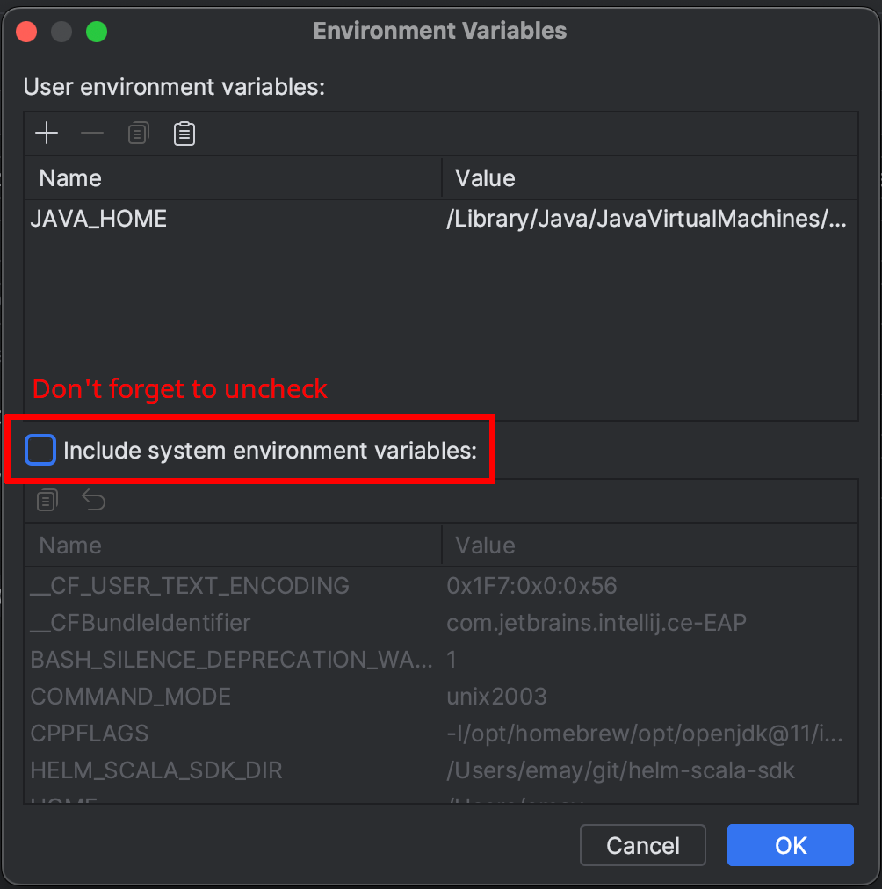
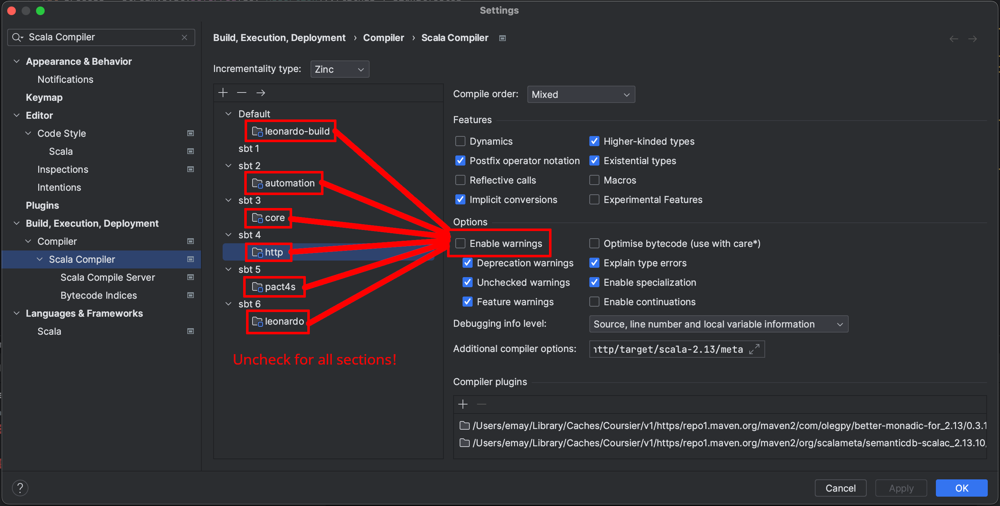

[](https://github.com/DataBiosphere/leonardo/actions) [](https://codecov.io/gh/DataBiosphere/leonardo)

# Leonardo

Leonardo serves as a way to launch compute within the Terra security boundary. It does so via multiple different cloud hardware virtualization mechanisms, currently leveraging only the Google Cloud Platform.

Leonardo supports launching the following services for compute:
- Spark clusters through [Google Dataproc](https://cloud.google.com/dataproc/)
- Virtual machines through [Google Compute Engine](https://cloud.google.com/compute)
- Kubernetes 'apps' through [Google Kubernetes Engine](https://cloud.google.com/kubernetes-engine)

Currently, leonardo supports the launching of custom docker images for Jupyter and Rstudio in virtual machines and Dataproc. It also supports launching applications in Kubernetes, with a spotlight on Galaxy.

- For more information on APIs, see [swagger](https://notebooks.firecloud.org/)
- For more information on custom docker images, see the [terra-docker repo](https://github.com/DataBiosphere/terra-docker)
- For more information on applications we support in Kubernetes, see the [terra-apps repo](https://github.com/DataBiosphere/terra-app)
- For more information on Galaxy, see the [Galaxy Project](https://github.com/galaxyproject)

It is recommended to consume these APIs and functionality via the [Terra UI](https://terra.bio/)

We use JIRA instead of the issues page on Github. If you would like to see what we are working you can visit our [active sprint](https://broadworkbench.atlassian.net/secure/RapidBoard.jspa?rapidView=35&projectKey=IA) or our [backlog](https://broadworkbench.atlassian.net/secure/RapidBoard.jspa?rapidView=35&projectKey=IA&view=planning&selectedIssue=IA-1753&epics=visible&issueLimit=100&selectedEpic=IA-1715) on JIRA. You will need to set-up an account to access, but it is open to the public.

## Java client library
for sbt:

```libraryDependencies += "org.broadinstitute.dsde.workbench" %% "leonardo-client" % "1.3.6-<git hash>"```

where ```<git hash>``` is the first 7 characters of the commit hash of the HEAD of develop
you can find our releases on [artifactory](https://broadinstitute.jfrog.io/ui/native/libs-release-local;build.timestamp=1679578230/org/broadinstitute/dsde/workbench/leonardo-client_2.11/)

Example Scala Usage:
```
import org.broadinstitute.dsde.workbench.client.leonardo.api.RuntimesApi
import org.broadinstitute.dsde.workbench.client.leonardo.ApiClient
import org.broadinstitute.dsde.workbench.client.leonardo.model.GetRuntimeResponse

class LeonardoClient(leonardoBasePath: String) {
  private def leonardoApi(accessToken: String): RuntimesApi = {
    val apiClient = new ApiClient()
    apiClient.setAccessToken(accessToken)
    apiClient.setBasePath(leonardoBasePath)
    new RuntimesApi(apiClient)
  }

  def getAzureRuntimeDetails(token: String, workspaceId: String, runtimeName: String): GetRuntimeResponse = {
    val leonardoApi = leonardoApi(token)
    leonardoApi.getAzureRuntime(workspaceId, runtimeName)
  }
}

```

## Building and running Leonardo
Clone the repo.
```
$ git clone https://github.com/DataBiosphere/leonardo.git
$ cd leonardo
```

### Running Leo Locally

#### Setup
Install gcloud using Homebrew:
```
brew install --cask google-cloud-sdk
```
Install Go using Homebrew:
```
brew install go
```
Note: Ensure that you are running go>=1.20 by running
```
go version
```

Update the helm-scala-sdk submodule:
```
git submodule init && git submodule update
```

#### VPN
You must be connected to the VPN if working remotely.

#### CloudSQL proxy settings
The CloudSQL proxy container uses a few environment variables. The following vars are pulled from Leo in dev in kubernetes:
* GOOGLE_PROJECT (e.g. "broad-dsde-dev")
* CLOUDSQL_ZONE (e.g. "us-central1")
* DB_USER (e.g. "leonardo")
If you are ok with these defaults, do nothing, otherwise run:
```
export GOOGLE_PROJECT=my-project-name
```
And change the var name and value as desired.

In order to develop locally, you *must* make a copy of the dev database and run
```
export CLOUDSQL_INSTANCE=<your cloned db name> # for Leo and CloudSQL proxy
export DB_USER=<db username> # for Leo only, not CloudSQL proxy
export DB_PASSWORD=<db password> # for Leo only, not CloudSQL proxy
```
You can add more vars for the CloudSQL proxy container by editing `./local/sqlproxy.env`.

#### Dependencies
Leo needs a copy of the Go Helm library and secrets, files, and env vars stored in k8s.

To build the Go Helm library and get k8s resources, run:
```
./local/depends.sh -y
```
To only build the Go Helm library, run:
```
./local/depends.sh helm
```
To only get k8s resources, run:
```
./local/depends.sh configs
```

#### Overrides
By adding entries to `./local/overrides.env`, you can override the value of any variable from k8s for Leo.

#### Unsetting
By adding entries to `./local/unset.env`, you can remove variables from k8s for Leo. Applied after retrieving
variables from k8s and before applying overrides.

#### Host alias
If you haven't already, add `127.0.0.1       local.dsde-dev.broadinstitute.org` to `/etc/hosts`:
```
sudo sh -c "echo '127.0.0.1       local.dsde-dev.broadinstitute.org' >> /etc/hosts"
```

#### Run proxies
To run the CloudSQL and Apache proxies, run:
```
./local/proxies.sh start
```
You can also stop them:
```
./local/proxies.sh stop
```
Or restart them:
```
./local/proxies.sh restart
```
If the CloudSQL proxy fails to start with an error like:
```
Bind for 0.0.0.0:3306 failed: port is already allocated
```
Run this to find the PID of the process using that port:
```
sudo lsof -i tcp:3306
```
And then kill that process:
```
sudo kill -TERM <pid>
```

#### Run Leo
Export required env vars as created by `./local/depends.sh`:
```
. ./http/src/main/resources/rendered/sbt.env.sh
```
Call the sbt `http/run` target:
```
sbt http/run
```
Or start an sbt shell and go from there:
```
sbt
```

#### Architecture issues
If you get an error like
```
Exception in thread "io-compute-6" java.lang.UnsatisfiedLinkError: Unable to load library 'helm':
...
(mach-o file, but is an incompatible architecture (have 'arm64', need 'x86_64')),
...
```
You are probably on an M1 (arm64) running an amd64 (x86_64) version of Java. You can verify by first finding and setting your `JAVA_HOME` (e.g. with `which java` or jenv if present) and then checking the output of
```
file "${JAVA_HOME}/bin/java
```
It should read something like
```
/Library/Java/JavaVirtualMachines/temurin-17.jdk/Contents/Home/bin/java: Mach-O 64-bit executable arm64
```
Note the **Mach-O 64-bit executable arm64**. Otherwise, install an arm64 version of Java and try again. [Adoptium](https://adoptium.net/) should work fine.

#### Verify that local Leo is running
[Status endpoint:
https://local.dsde-dev.broadinstitute.org/status](https://local.dsde-dev.broadinstitute.org/status)

[Swagger page:
https://local.dsde-dev.broadinstitute.org](https://local.dsde-dev.broadinstitute.org)

#### Debugging in IntelliJ
1. Install the [EnvFile plugin](https://plugins.jetbrains.com/plugin/7861-envfile)
2. Install the [Scala plugin](https://plugins.jetbrains.com/plugin/1347-scala)
3. Set up a new `Application` run configuration in `Run > Edit Configurations`:

(You may need to use the "Modify options" dropdown to unlock options like "Environment variables", "EnvFile", and "Add VM options")

4. Determine your Java home

The above configuration will fail to run properly due to missing `JAVA_HOME` in the environment. Unfortunately, IntelliJ doesn't propagate this to the running app. To figure out what it is, first run the new configuration, and scroll back up to the top of the output. The first line should look like:

Which means that `JAVA_HOME` should be set to `/Library/Java/JavaVirtualMachines/temurin-17.jdk/Contents/Home`.

Now you can go back into the run configuration and add it to the "Environment variables" section:


5. Run it!

#### Run Tests in IntelliJ
In order to use the GUI elements to run tests, some runtime configuration template changes are needed:
1. Set default ScalaTest runtime configuration options in `Run > Edit Configurations`

First, open the template settings:

Then, go to `ScalaTest`:

Open `VM Options` (labeled "1" above) and add the `JAVA_OPTS` from [Run Leonardo unit tests](#run-leonardo-unit-tests), which should end up looking like:

Open `Environment variables` (labeled "2" above) and uncheck `Include system environment variables`:

2. Change Scala compiler options in IntelliJ settings

IntelliJ isn't smart enough to set compiler flags differently between the source and test targets. To hack around this, open `Settings > Build, Execution, Deployment > Compier > Scala Compiler` and select **each** module. Then uncheck `Enable warnings`.

**NOTE: These changes may revert when you reload the sbt project!** Repeat this step to fix tests complaining about warnings that have been turned into errors.
If you get errors after compilation but before the tests run, try deleting your test Runtime Configuration, running `git clean -xfd -e .idea` to clean project files, redoing dependencies/configs, restarting IntelliJ, and redoing the above steps before rerunning tests.

3. Make sure the local MySQL server is running by following the instructions in [Run Leonardo unit tests](#run-leonardo-unit-tests).
4. Find a test to run and click on the green arrow next to the test to run it normally or using the debugger:

5. Run it!

You should see something like


#### Connecting to the MySQL database via the CloudSQL proxy
Once you've rendered the configs, started the CloudSQL proxy, and sourced the env vars required to run Leo, you can connect to your database with:
```
./local/proxies.sh dbconnect
```

#### Cleanup
When you're done, stop sbt (e.g. using Ctrl+C) and stop the proxies:
```
./local/proxies.sh stop
```

### Run Leonardo unit tests

Ensure docker is running. Spin up MySQL locally:
```
$ ./docker/run-mysql.sh start leonardo
```

Note, if you see error like
```
Warning: Using a password on the command line interface can be insecure.
ERROR 2003 (HY000): Can't connect to MySQL server on 'mysql' (113)
Warning: Using a password on the command line interface can be insecure.
ERROR 2003 (HY000): Can't connect to MySQL server on 'mysql' (113)
Warning: Using a password on the command line interface can be insecure.
ERROR 2003 (HY000): Can't connect to MySQL server on 'mysql' (113)
```
Run `docker system prune -a`. If the error persists, try restarting your laptop.

Build Leonardo and run all unit tests.
```
export JAVA_OPTS="-Dheadless=false -Duser.timezone=UTC -Xmx4g -Xss2M -Xms4G"
sbt clean compile "project http" test
```
You can also run a particular test suite, e.g.
```
sbt "testOnly *LeoAuthProviderHelperSpec"
```
or a particular test within a suite, e.g.

```
sbt "testOnly *LeoPubsubMessageSubscriberSpec -- -z "handle Azure StopRuntimeMessage and stop runtime""
```
where `map` is a substring within the test name.

If you made a change to the leonardo Db by adding a changeset xml file, and then adding that file path to the changelog
file, you have to set `initWithLiquibase = true` in the leonardo.conf file for these changes to be reflected in the unit
tests. Once youare done testing your changes, make sure to switch it back to `initWithLiquibase = false`, as this can do
some damage if you are running local Leo against Dev!

Once you're done, tear down MySQL.
```
./docker/run-mysql.sh stop leonardo
```

Do `docker restart leonardo-mysql` if you see `java.sql.SQLNonTransientConnectionException: Too many connections` error

* Running tests against FIAB
Checking FIAB mysql (fina password in /etc/leonardo.conf in firecloud_leonardo-app_1 container)
```bash
docker exec -it firecloud_leonardo-mysql_1 bash
root@2f5efbd4f138:/# mysql -u leonardo -p
```

## Run scalafmt
Learn more about [scalafmt](https://scalameta.org/scalafmt/docs/installation.html)
- `sbt scalafmtAll`

## Building Leonardo docker image

To install git-secrets
```$xslt
brew install git-secrets
```
To ensure git hooks are run
```$xslt
cp -r hooks/ .git/hooks/
chmod 755 .git/hooks/apply-git-secrets.sh
```

To build jar and leonardo docker image
```
./docker/build.sh jar -d build
```

To build jar and leonardo docker image
and push to repos `broadinstitute/leonardo`
tagged with git hash
```
./docker/build.sh jar -d push
```


## Github actions

Leonardo has custom runners for github actions, as they require more than the default 30GB provisioned by the `ubuntu-latest` Github runners

There are 3 nodes, you can view them here: https://github.com/DataBiosphere/leonardo/settings/actions/runners. They have 100GB currently. Devops can be contacted to increase the size if needed, but we only need ~60GB at time of writing.
